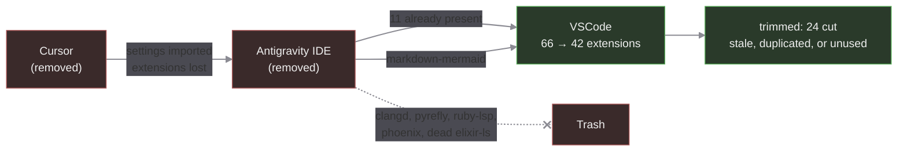

# VSCode et al

This documents my VSCode setup.

**Cursor and Antigravity were both removed on 2026-08-30.** VSCode is the
only editor now. Antigravity is available as a VSCode extension instead of
a fork, which is what prompted the move back; Cursor was several versions
stale and unused. Their extension lists live in git history if ever needed.

VSCode is now installed as a Homebrew cask (`visual-studio-code` in
`config.yaml`) rather than by hand, so a fresh machine reproduces it.

Profiles are still worth considering, but with a single editor and a
trimmed extension set the case is weaker than it was.

## Migration



## TODO

- [x] Trim to a defensible set (66 -> 42), removing stale and duplicated extensions
- [ ] Validate that each remaining extension does something I actually want
- [ ] Decide whether the extension list belongs in `config.yaml` with a reconciler

## Ideas

Split the problem:

- validation method: minimal requirements, or cue validation of json files
- explicit requirements for extensions and workflows
  - js/ts +deno,bun, markdown, go
  - formating and linting

## Minimal extensions

We added these to the Workspace recommendations: `.vscode/extensions.json`

## Validation

- [x] Markdown
  - [ ] should format the table below:

| Name               | Extension ID                          | Check |
| ------------------ | ------------------------------------- | :---: |
| Markdownlint       | davidanson.vscode-markdownlint        |   ✗   |
| Prettier           | esbenp.prettier-vscode                |   ✗   |
| Deno               | denoland.vscode-deno                  |   ✗   |
| Code Spell Checker | streetsidesoftware.code-spell-checker |   ✗   |

## Extensions

Current state. Cursor and Antigravity lists were removed with the editors;
`git log -- README-VSCode.md` has them.

### VSCode

```bash
$ code --list-extensions
arrterian.nix-env-selector
astro-build.astro-vscode
bierner.markdown-mermaid
bradlc.vscode-tailwindcss
brody715.vscode-cuelang
charliermarsh.ruff
davidanson.vscode-markdownlint
dbaeumer.vscode-eslint
denoland.vscode-deno
dnicolson.binary-plist
eamodio.gitlens
esbenp.prettier-vscode
evilz.vscode-reveal
firsttris.vscode-jest-runner
github.codespaces
github.vscode-pull-request-github
golang.go
jakebecker.elixir-ls
jnoortheen.nix-ide
khaeransori.json2csv
mechatroner.rainbow-csv
ms-azuretools.vscode-containers
ms-python.debugpy
ms-python.python
ms-python.vscode-pylance
ms-python.vscode-python-envs
ms-vscode-remote.remote-containers
ms-vscode-remote.remote-ssh
ms-vscode-remote.remote-ssh-edit
ms-vscode-remote.vscode-remote-extensionpack
ms-vscode.remote-explorer
ms-vscode.remote-server
ms-vsliveshare.vsliveshare
nefrob.vscode-just-syntax
pantajoe.vscode-elixir-credo
phoenixframework.phoenix
redhat.vscode-yaml
samuel-pordeus.elixir-test
streetsidesoftware.code-spell-checker
unifiedjs.vscode-mdx
vitest.explorer
yoavbls.pretty-ts-errors
```
