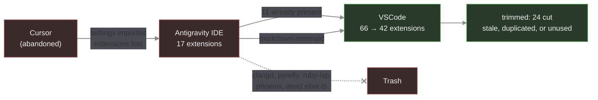

# VSCode et al

This is to document my VSCode and it's clones' setup.

When I Installed Antigravity, it imported my settings from Cursor, but failed to bring in my extensions. So I will now try to remediate that, by finally documenting a reasonale way to do it.

We should probably be using profiles, perhaps thos would be importable from clone to clone.

## Migration



## TODO

- Remove all unknown extensions from antigravity as a starting point
- add known useful extensions, and document/validate functionality

## Ideas

Split the problem:

- validation method: minimal requirements, or cue validation of json files
- explicit requirements for extensions and workflows
  - js/ts +deno,bun, markdown, go
  - formating and linting

## Minimal extensions

We added these to the Workspace recommendations: `.vscode/extensions.json`

## Validation

- [x] Markdown
  - [ ] should format the table below:

| Name               | Extension ID                          | Check |
| ------------------ | ------------------------------------- | :---: |
| Markdownlint       | davidanson.vscode-markdownlint        |   ✗   |
| Prettier           | esbenp.prettier-vscode                |   ✗   |
| Deno               | denoland.vscode-deno                  |   ✗   |
| Code Spell Checker | streetsidesoftware.code-spell-checker |   ✗   |

## Extensions

Just lists for now, til we figure this out

### Antigravity (removed 2026-08-30)

Kept as a record of what the fork had installed. The fork is being
uninstalled; Google now ships Antigravity as a VSCode extension.

```bash
$ "/Applications/Antigravity IDE.app/Contents/Resources/app/bin/antigravity-ide" --list-extensions
astro-build.astro-vscode
bierner.markdown-mermaid
bradlc.vscode-tailwindcss
davidanson.vscode-markdownlint
denoland.vscode-deno
eamodio.gitlens
elixir-lsp.elixir-ls
esbenp.prettier-vscode
golang.go
llvm-vs-code-extensions.vscode-clangd
meta.pyrefly
ms-python.debugpy
ms-python.python
ms-python.vscode-python-envs
shopify.ruby-lsp
streetsidesoftware.code-spell-checker
victorbjorklund.phoenix
```

### Cursor

```bash
$ cursor --list-extensions
anysphere.cursorpyright
anysphere.pyright
arrterian.nix-env-selector
astro-build.astro-vscode
bradlc.vscode-tailwindcss
brody715.vscode-cuelang
catppuccin.catppuccin-vsc-pack
charliermarsh.ruff
davidanson.vscode-markdownlint
dbaeumer.vscode-eslint
denoland.vscode-deno
donjayamanne.python-environment-manager
eamodio.gitlens
editorconfig.editorconfig
esbenp.prettier-vscode
evilz.vscode-reveal
fcrespo82.markdown-table-formatter
github.codespaces
github.vscode-github-actions
github.vscode-pull-request-github
golang.go
jnoortheen.nix-ide
mhutchie.git-graph
mkhl.direnv
ms-azuretools.vscode-docker
ms-python.debugpy
ms-python.python
ms-python.vscode-pylance
ms-toolsai.jupyter
ms-toolsai.jupyter-renderers
ms-toolsai.vscode-jupyter-cell-tags
ms-toolsai.vscode-jupyter-slideshow
ms-vscode-remote.remote-containers
ms-vscode-remote.vscode-remote-extensionpack
ms-vsliveshare.vsliveshare
nefrob.vscode-just-syntax
nrwl.angular-console
octref.vetur
pinage404.nix-extension-pack
redhat.vscode-yaml
rust-lang.rust-analyzer
streetsidesoftware.code-spell-checker
unifiedjs.vscode-mdx
```

### VSCode

```bash
$ code --list-extensions
arrterian.nix-env-selector
astro-build.astro-vscode
bierner.markdown-mermaid
bradlc.vscode-tailwindcss
brody715.vscode-cuelang
charliermarsh.ruff
davidanson.vscode-markdownlint
dbaeumer.vscode-eslint
denoland.vscode-deno
dnicolson.binary-plist
eamodio.gitlens
esbenp.prettier-vscode
evilz.vscode-reveal
firsttris.vscode-jest-runner
github.codespaces
github.vscode-pull-request-github
golang.go
jakebecker.elixir-ls
jnoortheen.nix-ide
khaeransori.json2csv
mechatroner.rainbow-csv
ms-azuretools.vscode-containers
ms-python.debugpy
ms-python.python
ms-python.vscode-pylance
ms-python.vscode-python-envs
ms-vscode-remote.remote-containers
ms-vscode-remote.remote-ssh
ms-vscode-remote.remote-ssh-edit
ms-vscode-remote.vscode-remote-extensionpack
ms-vscode.remote-explorer
ms-vscode.remote-server
ms-vsliveshare.vsliveshare
nefrob.vscode-just-syntax
pantajoe.vscode-elixir-credo
phoenixframework.phoenix
redhat.vscode-yaml
samuel-pordeus.elixir-test
streetsidesoftware.code-spell-checker
unifiedjs.vscode-mdx
vitest.explorer
yoavbls.pretty-ts-errors
```
